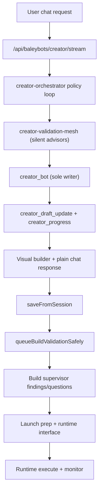

# Creator -> Build -> Launch -> Runtime Map (V7)

## North Star
Creator behaves like one strong chat partner. Internal BaleyBots run continuously in the background, but only `creator_bot` speaks to users and writes BAL.

## As-Is to Target

## Internal BB Role Matrix
| Internal BB | Role | Writes BAL | Visible to user |
|---|---|---|---|
| `creator_discovery` | Detect unresolved required details and question necessity | No | No |
| `connection_advisor` | Dependency and connection sufficiency analysis | No | No |
| `deployment_advisor` | Start behavior and readiness risk analysis | No | No |
| `integration_builder` | Integration setup advice when integration signals exist | No | No |
| `test_generator` | Dynamic test-plan generation from current draft | No | No |
| `test_validator` | Semantic validation against intent | No | No |
| `test_results_analyzer` | Failure pattern analysis and fix hints | No | No |
| `creator_action_advisor` | Optional next-step advisory payloads for orchestrator logic | No | No |
| `creator_bot` | Draft synthesis and final BAL authoring | Yes | Yes |

## Event Contract (User-Safe)
Default creator stream exposes only:
- `creator_progress`
- `creator_draft_update`
- `creator_complete`
- `creator_error`

Removed from default user stream:
- `creator_plan_delta`
- `creator_action_suggestions`
- Internal tool/advisor identity events

## Firewall Rules
1. Internal BB outputs are advisory-only structured diagnostics.
2. Internal BB identities are never surfaced in default creator chat.
3. `creator_bot` is the only BAL writer.
4. Build findings stay in Build surfaces, not creator chat.

## BAL Composition Guidance (for creator outputs)
Use canonical constructs in generated BAL:
- Single entity: one agent when scope is narrow.
- Chain: `chain { ... }` for dependent stages.
- Parallel: `parallel { ... }` for independent fan-out work.
- Loop: `loop ("until": "...", "max": N) { ... }` only for bounded refinement.

Keep composition explicit whenever >1 entity is present so visual round-trip and build validation remain deterministic.
