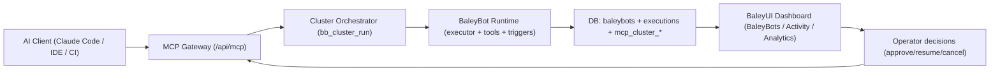

# BaleyUI MCP Cluster - Use Cases and UX Validation

**Status:** Proposed (Execution Blocked Pending Foundation Contract Hardening)  
**Date:** 2026-02-08  
**Branch:** `codex/mcp-development`  
**Depends On:**
1. `docs/reference/BALEYUI_MCP_CLUSTER_SPEC.md`
2. `docs/plans/2026-02-08-baleyui-mcp-cluster-implementation-plan.md`
3. `docs/reference/BALEYUI_FOUNDATION_CONTRACT_HARDENING_SPEC.md`

---

## 1. Purpose

Pressure-test the MCP cluster concept with realistic user flows, validate UX behavior for both AI clients and human operators, and define how to assemble the full product across MCP + BaleyUI dashboard.

This document answers:
1. Which end-to-end scenarios must work at launch.
2. What "good UX" looks like for `bb_cluster_run` and `needs_input`.
3. How existing BaleyUI pages should be extended to support MCP operations.
4. Which acceptance tests (manual + automated) must pass before rollout.

---

## 2. UX Design Targets

### 2.1 User types

1. **AI Client User (primary):** Uses Claude Code/IDE agent/CI agent via MCP tools.
2. **Workspace Operator (secondary):** Uses BaleyUI dashboard to inspect, approve, debug, and optimize MCP runs.
3. **Platform Admin (secondary):** Sets policy, budgets, and access controls.

### 2.2 UX outcomes for v1

1. AI clients can complete complex requests through one entrypoint (`bb_cluster_run`) without losing control.
2. Every blocking condition is represented as structured `needs_input` with explicit next action.
3. Operators can trace MCP requests to BaleyBot executions using correlation IDs (`requestId`, `runId`, `stepId`, `executionId`).
4. Budget/policy limits are transparent and recoverable (clear code + remediation hint).

### 2.3 UX anti-goals for v1

1. Hidden autonomous destructive actions.
2. Opaque failures without retry path.
3. Separate MCP-only control plane that duplicates BaleyUI execution behavior.

---

## 3. How It Fits Together



### 3.1 Assembly model (v1)

1. **Single agentic entrypoint:** `bb_cluster_run` + `bb_cluster_resume` + `bb_cluster_get` + `bb_cluster_cancel`.
2. **Deterministic escape hatch:** direct `bb_*` tools remain available for CI or strict workflows.
3. **Shared run state:** orchestrator writes durable run/step/event records (`mcp_cluster_*` tables).
4. **Dual visibility:** MCP resources for AI clients and dashboard surfaces for operators share same underlying data.

---

## 4. End-to-End Use Cases

### UC-01: Greenfield Build and Execute (Two-Bot Pipeline)

**Intent:** "Create a daily competitor news digest workflow and run a dry-run now."

**Preconditions:**
1. API key has `execute`.
2. Workspace has at least one AI provider connection.

**MCP flow:**
1. Client calls `bb_cluster_run` with `mode=execute`.
2. Run is `planned` with steps:
   - create/reuse researcher BB
   - create/reuse summarizer BB
   - wire trigger
   - execute dry-run
3. Orchestrator executes via existing creation + executor paths.
4. Run returns `completed` with produced bot IDs, trigger config, and dry-run result.

**UX assertions:**
1. AI client receives one coherent summary, not scattered tool outputs.
2. `/dashboard/baleybots` immediately shows both bots.
3. `/dashboard/activity` shows correlated executions.
4. Operator can open each bot detail page and confirm trigger wiring.

**Pass criteria:**
1. No manual intervention required.
2. `runId` maps to all step and execution records.

---

### UC-02: Clarification Loop (`needs_input`) for Missing Inputs

**Intent:** "Set up a webhook-triggered lead qualification system."

**Preconditions:**
1. Request omits webhook route naming convention and destination output.

**MCP flow:**
1. Client calls `bb_cluster_run`.
2. Orchestrator returns `needs_input`:
   - `reason=missing_inputs`
   - structured questions for webhook path, payload schema, destination.
3. Client prompts human and collects answers.
4. Client calls `bb_cluster_resume` with answers.
5. Run returns `completed`.

**UX assertions:**
1. Question IDs are stable across retries.
2. Questions are specific and answerable in one pass.
3. Resume does not restart completed steps.

**Pass criteria:**
1. Single resume call can complete run.
2. Timeline shows `running -> needs_input -> running -> completed`.

---

### UC-03: Policy-Gated Approval

**Intent:** "Create a bot that sends outbound notifications to customers."

**Preconditions:**
1. Workspace policy marks notification action as approval-required.

**MCP flow:**
1. Client calls `bb_cluster_run`.
2. Run pauses with `needs_input`:
   - `reason=approval_required`
   - approval items include tool name, risk class, proposed payload.
3. Human approves/denies.
4. Client calls `bb_cluster_resume` with decisions.
5. Run either:
   - continues and `completed`, or
   - ends with safe alternative and warning summary.

**UX assertions:**
1. Approval payload is explicit about what will be executed.
2. Denial path still provides useful next actions.

**Pass criteria:**
1. No approval, no sensitive action.
2. Full audit trail includes approver decision and timestamp.

---

### UC-04: Multi-BaleyBot Parallel Orchestration

**Intent:** "Research 3 competitors in parallel, then synthesize one report."

**Preconditions:**
1. Spawn depth/budget limits are within defaults.

**MCP flow:**
1. `bb_cluster_run` creates plan with parallel branches.
2. Branch steps run concurrently using BAL-compatible composition patterns.
3. Aggregation step merges branch outputs.
4. Final step produces consolidated summary artifact.

**UX assertions:**
1. Timeline clearly shows parallel step start/end.
2. Partial branch failures are visible with branch-specific errors.
3. Final summary states confidence and missing branch data (if any).

**Pass criteria:**
1. Parallel run remains within `maxSteps`, `maxDurationMs`, and budget.
2. `stepId -> executionId` mapping is complete for each branch.

---

### UC-05: Deterministic CI Mode (Non-Agentic Path)

**Intent:** CI pipeline deploys known BB updates without open-ended planning.

**Preconditions:**
1. CI key has restricted permissions and fixed payloads.

**MCP flow:**
1. CI calls `bb_update` for known bot IDs.
2. CI calls `bb_execute`.
3. CI polls via `bb_get_execution` or reads execution resources.

**UX assertions:**
1. No hidden orchestration side effects.
2. Responses stay schema-stable for machine parsing.

**Pass criteria:**
1. CI can run without `bb_cluster_run`.
2. Permission model blocks unauthorized cluster tools.

---

### UC-06: Budget/Duration Failure with Recoverability

**Intent:** "Run this broad market analysis with no limits" (potentially expensive).

**Preconditions:**
1. Workspace default budget is low.

**MCP flow:**
1. Run starts.
2. Budget guard trips before or during execution.
3. Run returns terminal state with `BUDGET_EXCEEDED` (or `timed_out`).
4. Response includes consumed budget, partial outputs, and recommended next steps.

**UX assertions:**
1. Failure is explicit and non-ambiguous.
2. Partial work is recoverable and inspectable via timeline.

**Pass criteria:**
1. No silent truncation.
2. Subsequent run with adjusted constraints succeeds.

---

### UC-07: Postmortem and Debugging from MCP + Dashboard

**Intent:** Operator investigates failed run reported by AI client.

**Preconditions:**
1. Failed run has steps and linked executions.

**MCP flow:**
1. Client reads `baleyui://runs/{runId}` and `baleyui://runs/{runId}/timeline`.
2. Operator opens dashboard activity/execution detail views.
3. Operator identifies failing connector/tool and applies fix.
4. Client retries via new run.

**UX assertions:**
1. MCP timeline and dashboard execution details tell the same story.
2. Error codes are canonical and map cleanly to remediation guidance.

**Pass criteria:**
1. Mean time to root cause stays low (target: <10 minutes for known classes).
2. Retry success is attributable to documented fix.

---

### UC-08: Tenant Isolation and Scope Enforcement

**Intent:** Client attempts access to another workspace run/bot.

**Preconditions:**
1. Two distinct workspaces with separate keys.

**MCP flow:**
1. Key from workspace A calls `bb_cluster_get` for run in workspace B.
2. Server returns `FORBIDDEN` or `NOT_FOUND` without leakage.

**UX assertions:**
1. No existence leakage through metadata or timing side channels.
2. Logs contain attempted cross-tenant access for security review.

**Pass criteria:**
1. Isolation checks pass for all tools and resources.

---

## 5. UX Test Plan

### 5.1 Manual script set (operator + AI-client dogfood)

| Test ID | Scenario | Primary Interface | Success Signal |
|---------|----------|-------------------|----------------|
| UX-MCP-01 | UC-01 Greenfield build | Claude Code + dashboard | Single-pass completion and visible new bots |
| UX-MCP-02 | UC-02 needs_input | Claude Code | Structured questions, one resume, no lost progress |
| UX-MCP-03 | UC-03 approval | Claude Code + dashboard | Approval gate blocks until explicit decision |
| UX-MCP-04 | UC-04 parallel run | Claude Code + activity views | Parallel branches visible and correlated |
| UX-MCP-05 | UC-06 budget fail | Claude Code + analytics | Deterministic failure with actionable remediation |
| UX-MCP-06 | UC-07 debugging | MCP resources + activity/execution details | Same root cause visible in both surfaces |
| UX-MCP-07 | UC-08 isolation | API client | No cross-tenant data exposure |

### 5.2 Automated tests (must-have before early access)

1. **Contract tests (Vitest):**
   - Validate all MCP tool input/output schemas.
   - Validate canonical error payload structure.
2. **Lifecycle tests (Vitest + DB fixtures):**
   - Allowed transitions only.
   - Terminal-state immutability.
   - Idempotency key behavior.
3. **Permission matrix tests:**
   - `read`, `execute`, `admin` behavior.
   - Forbidden actions blocked deterministically.
4. **Integration tests:**
   - Multi-BB run with `needs_input` and resume.
   - Budget and policy blocking behavior.
5. **E2E tests (Playwright):**
   - Operator can inspect run/execution linkage in dashboard.
   - Correlation IDs visible and consistent.

### 5.3 Usability quality gates

1. **Clarity:** `needs_input` question set completion rate >= 90% in one resume attempt.
2. **Control:** cancel command reflected in run state within 2 seconds p95.
3. **Trust:** every failed run exposes at least one actionable next step.
4. **Traceability:** 100% of cluster steps linked to run and (if applicable) execution IDs.

---

## 6. UI Integration Blueprint (Use Existing Surfaces First)

### 6.1 Existing surfaces to extend

| Surface | Current Capability | MCP Enhancement |
|---------|--------------------|-----------------|
| `/dashboard/baleybots` | List and manage bots | Add "created/updated by MCP run" context badge and quick link to `runId` |
| `/dashboard/baleybots/[id]` | Creator + triggers + tests + monitor | Add "MCP Context" card with latest run/step lineage |
| `/dashboard/activity` | Execution feed | Add filter chip for MCP-originated runs and correlation column |
| `/dashboard/activity/executions/[id]` | Execution detail | Add linked `runId` + `stepId` + parent cluster status |
| `/dashboard/analytics` | Cost/latency overview | Add run-level breakdown and policy/budget breach counters |

### 6.2 New surface (recommended by Phase 6)

1. Add `/dashboard/mcp/runs`:
   - Run list with status, owner key, cost, duration, blocked reason.
2. Add `/dashboard/mcp/runs/[runId]`:
   - Plan snapshot, timeline, approvals, resumable question payloads.

This avoids overloading activity pages while preserving existing operator workflow.

---

## 7. MCP Response UX Contract (Recommended Additions)

The current spec is strong; these additions improve client UX reliability:

1. Add `nextActions` array to `bb_cluster_run`/`bb_cluster_get` responses.
2. Add `links` object:
   - `runResourceUri`
   - `timelineResourceUri`
   - optional dashboard URLs for operators.
3. Add `progress` object:
   - `completedSteps`
   - `totalSteps`
   - `estimatedRemainingMs`.
4. Require stable `question.id` across retries/reloads.
5. Add `partialResult` field for `timed_out`/`BUDGET_EXCEEDED` runs.

Example response extension:

```json
{
  "runId": "uuid",
  "status": "needs_input",
  "summary": "Need webhook destination settings",
  "progress": { "completedSteps": 2, "totalSteps": 5, "estimatedRemainingMs": 35000 },
  "needsInput": {
    "reason": "missing_inputs",
    "questions": [{ "id": "dest_channel", "prompt": "Where should results be delivered?", "type": "single_select" }]
  },
  "nextActions": ["answer_questions", "resume_run"],
  "links": {
    "runResourceUri": "baleyui://runs/uuid",
    "timelineResourceUri": "baleyui://runs/uuid/timeline"
  }
}
```

---

## 8. Recommended Implementation Sequencing for UX

1. **Phase A (minimum lovable UX):**
   - `bb_cluster_run`, `bb_cluster_resume`, `bb_cluster_get`, `bb_cluster_cancel`
   - timeline resource
   - activity/execution linkage
2. **Phase B (operator-grade control):**
   - dedicated MCP run pages
   - approval inbox and resume helpers
   - analytics run breakdown
3. **Phase C (ecosystem polish):**
   - prompt templates (`cluster_planner`, `cluster_debugger`)
   - richer client hints (`nextActions`, progress ETA)
   - feature-flagged advanced policies

---

## 9. Go/No-Go Checklist for Phase 1 Build Start

Proceed to implementation only when all are true:
1. UC-01 to UC-03 have signed-off acceptance criteria.
2. `needs_input` schema and resume behavior are frozen.
3. Correlation ID propagation is designed end-to-end.
4. Permission matrix and default budget thresholds are approved.
5. Test harness ownership is assigned for contract, lifecycle, and E2E tests.

---

## 10. Immediate Next Action

Run a focused "UX dry run" on UC-01, UC-02, and UC-03 with mocked MCP responses before coding Phase 1.  
If those flows read clearly in Claude Code and the dashboard mockups, proceed with implementation phases from `docs/plans/2026-02-08-baleyui-mcp-cluster-implementation-plan.md`.
