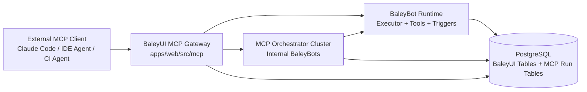
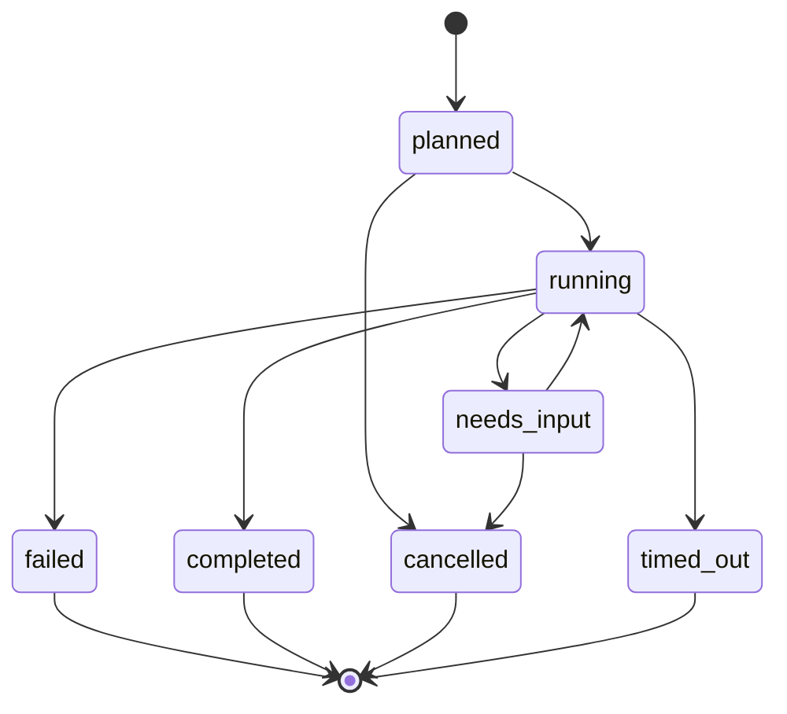

# BaleyUI MCP Cluster Specification

**Status:** Proposed (Blocked Pending Foundation Contract Hardening)
**Date:** 2026-02-08
**Owners:** Platform + BaleyBot Runtime
**Blocked By:** `docs/reference/BALEYUI_FOUNDATION_CONTRACT_HARDENING_SPEC.md`
**Supersedes:** `docs/plans/2026-02-03-baleyui-mcp-server-design.md`

---

## 1. Purpose

Define a production MCP interface for BaleyUI that supports:

1. Agentic requests through a cluster-style orchestrator.
2. Direct tools/resources for deterministic integrations.
3. Multi-BaleyBot execution in one run, including connectors/triggers.
4. Full observability, governance, and resumable execution.

This spec is normative for MCP behavior and interfaces.

---

## 2. Scope

### In Scope

1. MCP server contract (tools, resources, prompts, auth, errors).
2. Agentic cluster run lifecycle (`planned -> running -> needs_input -> completed/failed/cancelled/timed_out`).
3. Multi-BB orchestration with `spawn_baleybot`, trigger wiring, and shared storage.
4. Budget, policy, and safety constraints.
5. Analytics and traceability surfaces for MCP clients.

### Out of Scope (v1)

1. Cross-workspace federation in one MCP connection.
2. Arbitrary user code execution outside existing BaleyUI tool/runtime safeguards.
3. Long-lived conversational memory outside workspace-managed storage.
4. Autonomous destructive actions without explicit policy approval.

---

## 3. Design Principles

1. Reuse BaleyUI runtime paths whenever possible.
2. Keep MCP as an integration layer, not a separate execution engine.
3. Prefer resumable/pollable workflows over client-bound sessions.
4. Make every run traceable from MCP call to tool calls and costs.
5. Default to safe limits; allow explicit policy overrides.

---

## 4. High-Level Architecture



### 4.1 Components

1. **MCP Gateway**
   - Protocol handling, schema validation, auth, tool/resource registration.
2. **Orchestrator Cluster**
   - Plans and executes multi-step/multi-BB requests.
   - Uses internal BBs and existing creation pipeline.
3. **Runtime Plane**
   - Existing BaleyBot execution path, tools, connectors, trigger services.
4. **Observability Plane**
   - Run status, timelines, costs, tool traces, alerts.

---

## 5. Transport and Endpoints

### 5.1 Primary Transport

1. **Streamable HTTP MCP** (primary).
2. Endpoint: `POST /api/mcp` (and transport-defined MCP subpaths if required by SDK).

### 5.2 Secondary Transport

1. **SSE transport** for compatibility if client cannot use streamable HTTP.
2. Endpoint: `GET /api/mcp/sse` (optional in v1 if SDK compatibility requires it).

### 5.3 Optional Distribution Mode

1. Optional local stdio wrapper package (v2) that proxies to hosted MCP over HTTP.

---

## 6. Authentication and Authorization

### 6.1 Authentication

1. API key via `Authorization: Bearer bui_live_*`.
2. Workspace resolved from key hash validation.

### 6.2 Authorization (v1)

Use existing permissions in `api_keys.permissions`:

1. `read`: resources and read-only tools.
2. `execute`: run/create/update execution tools.
3. `admin`: policy-changing and destructive operations.

### 6.3 Authorization (recommended v1.1)

Add optional fine-grained scopes:

1. `mcp:read`
2. `mcp:run`
3. `mcp:manage`
4. `mcp:analytics`

`admin` continues to imply all.

### 6.4 Workspace Isolation

1. Every tool/resource operation must enforce workspace ownership.
2. No cross-workspace IDs accepted unless explicitly supported in future versions.

---

## 7. MCP Tool Contract

Tools are grouped by role.

### 7.1 Agentic Entry Point

#### `bb_cluster_run`

**Purpose:** Accept natural-language or structured intent; orchestrator plans and executes via BaleyBot cluster.

**Input schema (logical):**

```json
{
  "type": "object",
  "properties": {
    "request": { "type": "string" },
    "mode": { "type": "string", "enum": ["auto", "plan_only", "execute"] },
    "context": { "type": "object", "additionalProperties": true },
    "constraints": {
      "type": "object",
      "properties": {
        "maxBudgetUsd": { "type": "number", "minimum": 0 },
        "maxDurationMs": { "type": "integer", "minimum": 1000 },
        "maxSteps": { "type": "integer", "minimum": 1 }
      }
    },
    "idempotencyKey": { "type": "string" }
  },
  "required": ["request"]
}
```

**Output schema (logical):**

```json
{
  "runId": "uuid",
  "status": "planned|running|needs_input|completed|failed|cancelled|timed_out",
  "summary": "string",
  "plan": [{ "stepId": "string", "type": "string", "status": "pending|running|completed|failed|skipped" }],
  "needsInput": {
    "reason": "missing_inputs|approval_required|external_confirmation|policy_block",
    "questions": [
      {
        "id": "string",
        "prompt": "string",
        "type": "text|single_select|multi_select|confirmation",
        "options": ["string"]
      }
    ]
  }
}
```

### 7.2 Run Control Tools

1. `bb_cluster_resume`
   - Resume a `needs_input` run with answers.
2. `bb_cluster_cancel`
   - Cancel running/planned run.
3. `bb_cluster_get`
   - Get latest run status snapshot.

### 7.3 Direct BaleyBot Tools

1. `bb_create`
   - Create BB from description or BAL (uses creator path where applicable).
2. `bb_update`
   - Update metadata/BAL for existing BB.
3. `bb_execute`
   - Start single BB execution.
4. `bb_get_execution`
   - Get execution state/result.
5. `bb_list`
   - List BBs with filters.

### 7.4 Integration/Connector Tools

1. `bb_trigger_upsert`
   - Create/update BB completion trigger.
2. `bb_trigger_list`
   - List source/target triggers.
3. `bb_tools_list`
   - List workspace tool catalog (built-in, connection-derived, custom).

### 7.5 Analytics Tools

1. `bb_analytics_summary`
   - Aggregated metrics/cost/errors for a window.
2. `bb_analytics_run_breakdown`
   - Per-run/step breakdown.

### 7.6 Tool Naming Rules

1. All BaleyUI MCP tools are prefixed `bb_`.
2. No unprefixed aliases in v1.
3. New tools are additive; removals require deprecation window.

---

## 8. MCP Resources Contract

### 8.1 Core Resources

1. `baleyui://baleybots`
2. `baleyui://baleybots/{id}`
3. `baleyui://executions`
4. `baleyui://executions/{id}`
5. `baleyui://runs/{runId}`
6. `baleyui://runs/{runId}/timeline`
7. `baleyui://catalog/tools`
8. `baleyui://analytics/overview`

### 8.2 Parameterized Resource Templates

1. `baleyui://baleybots?status={status}&cursor={cursor}&limit={limit}`
2. `baleyui://executions?baleybotId={id}&status={status}&cursor={cursor}&limit={limit}`
3. `baleyui://analytics/overview?window={7d|30d|90d}`

### 8.3 Pagination

1. Cursor-based pagination only.
2. Standard fields:
   - `items`
   - `nextCursor`
   - `hasMore`

---

## 9. MCP Prompts Contract

1. `cluster_planner`
   - Prompt template for orchestration planning.
2. `cluster_debugger`
   - Prompt template for failed run diagnosis.
3. `tool_selection_guide`
   - Prompt template listing tool constraints and recommendations.

Prompts are optional for core functionality but required for excellent client UX.

---

## 10. Cluster Run Lifecycle



### 10.1 Lifecycle Rules

1. `planned` must include a deterministic execution plan snapshot.
2. `needs_input` must include structured question payload.
3. `resume` transitions only from `needs_input` to `running`.
4. Terminal states are immutable (`completed`, `failed`, `cancelled`, `timed_out`).

### 10.2 Idempotency

1. `bb_cluster_run` and `bb_cluster_resume` must accept `idempotencyKey`.
2. Same key + same workspace + same payload returns same `runId`.
3. Key collision with different payload returns conflict error.

---

## 11. Orchestrator Cluster Behavior

### 11.1 Suggested Internal BB Topology

1. `mcp_orchestrator` (entrypoint)
2. `creator_bot` (creation/modification path)
3. `integration_builder` (connectors/triggers path)
4. `execution_reviewer` (result QA and remediation suggestions)

### 11.2 Planning Requirements

1. Explicit step list with step type and expected output.
2. Step-level tool/policy checks before execution.
3. Ability to call multiple BBs in sequence/parallel using existing BAL compositions.

### 11.3 Execution Requirements

1. Steps execute through existing BaleyBot executor paths.
2. Nested spawns honor depth and budget limits.
3. Trigger-based fan-out must record step provenance.

---

## 12. Policy, Budget, and Safety

### 12.1 Default Limits

1. `maxSpawnDepth`: 5
2. `maxStepsPerRun`: 30
3. `maxDurationMs`: 300000
4. `maxToolCalls`: 100
5. `maxBudgetUsd`: workspace default (recommended 2.00)

### 12.2 Policy Evaluation Order

1. API key permissions
2. Workspace policy allow/deny lists
3. Run-level constraints
4. Tool-level approval requirements

### 12.3 Approval Handling

1. If approval is required and cannot be auto-approved:
   - Run transitions to `needs_input`.
   - Response includes exact pending approval items.
2. Resume payload must include approval decisions.

### 12.4 Tool Promotion Safety

1. Auto-promotion from ephemeral tools must be policy-gated.
2. Promotion must be auditable with actor and source run.

---

## 13. Error Model

All tool errors return structured data:

```json
{
  "code": "string",
  "message": "string",
  "retryable": false,
  "requestId": "string",
  "details": {
    "field": "value"
  }
}
```

### 13.1 Canonical Error Codes

1. `UNAUTHORIZED`
2. `FORBIDDEN`
3. `NOT_FOUND`
4. `VALIDATION_ERROR`
5. `POLICY_BLOCKED`
6. `RATE_LIMITED`
7. `BUDGET_EXCEEDED`
8. `CONFLICT`
9. `EXECUTION_FAILED`
10. `INTERNAL_ERROR`

### 13.2 Mapping Rule

1. tRPC/domain errors are mapped to canonical MCP error codes.
2. Internal stack traces are never returned.

---

## 14. Data Model Requirements

### 14.1 New Tables (Recommended)

1. `mcp_cluster_runs`
   - `id`, `workspace_id`, `request_text`, `status`, `plan_json`, `constraints_json`, `summary`, `idempotency_key`, `started_at`, `completed_at`, `created_at`, `updated_at`.
2. `mcp_cluster_steps`
   - `id`, `run_id`, `step_order`, `step_type`, `name`, `status`, `input_json`, `output_json`, `error`, `baleybot_execution_id`, `started_at`, `completed_at`.
3. `mcp_cluster_checkpoints`
   - `id`, `run_id`, `checkpoint_order`, `state_json`, `created_at`.
4. `mcp_cluster_events`
   - `id`, `run_id`, `event_index`, `event_type`, `event_data`, `created_at`.

### 14.2 Existing Tables Reused

1. `baleybots`
2. `baleybot_executions`
3. `baleybot_triggers`
4. `tools`
5. `connections`
6. `workspace_policies`
7. `baleybot_metrics`

### 14.3 Data Integrity

1. Multi-record state transitions use transactions.
2. Step writes and run status writes are atomic per transition.

---

## 15. Observability Requirements

### 15.1 Correlation IDs

1. `requestId` per MCP request.
2. `runId` per cluster run.
3. `stepId` per cluster step.
4. `executionId` for mapped BaleyBot execution.

### 15.2 Required Metrics

1. Runs started/completed/failed/cancelled/timed_out.
2. Mean and p95 run duration.
3. Tool call counts and failure rates.
4. Budget breaches and policy blocks.
5. Step retry counts.

### 15.3 Resource Visibility

1. Timeline resource must show ordered events and step transitions.
2. Analytics resources must be queryable by window and run filters.

---

## 16. Versioning and Compatibility

1. Protocol version tagged as `v1` in server metadata.
2. Additive changes allowed in minor versions.
3. Breaking changes require new major contract (`v2`) and migration guide.
4. Deprecated tools/resources remain available for at least one minor cycle.

---

## 17. Security and Compliance Requirements

1. Enforce workspace-level tenant isolation for all reads/writes.
2. Redact secrets from logs and resource payloads.
3. Store API keys hashed only; never expose plaintext after creation.
4. Validate all JSON inputs with strict schemas.
5. Deny unknown tool names and unsupported step types.

---

## 18. Acceptance Criteria

1. A client can execute a multi-BB run through `bb_cluster_run` and receive resumable status.
2. A run requiring clarification returns `needs_input` with structured questions.
3. Resume completes via `bb_cluster_resume` without losing state.
4. Tool/resource auth enforcement is correct for `read`, `execute`, and `admin` keys.
5. Every run exposes timeline and analytics resources with traceable IDs.

---

## 19. Immediate Recommendations Before Build Starts

1. Approve this spec as source of truth for MCP v1.
2. Decide whether fine-grained MCP scopes ship in v1 or v1.1.
3. Approve new run tables (`mcp_cluster_*`) instead of overloading `baleybot_executions`.
4. Approve default budget limits and policy precedence.
5. Freeze tool/resource names to prevent client breakage during implementation.
