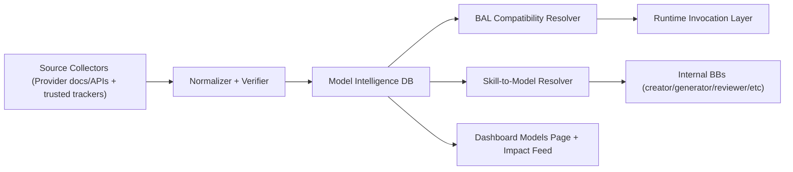

# BaleyUI Model Intelligence and BAL Compatibility Spec

**Status:** Proposed  
**Date:** 2026-02-08  
**Owner:** Platform Runtime + Internal BaleyBots  
**Purpose:** Define a continuously updated model intelligence system that powers model selection, BAL invocation compatibility, and operator visibility.

---

## 1. Why This Exists

BaleyUI needs a source of truth for:

1. Which models exist now (and what changed recently).
2. Which models BaleyUI can actually invoke through BAL.
3. Which model should be chosen for a given skill/use case under current policy/cost constraints.

Without this layer, model choice drifts into prompts and manual updates.

---

## 2. Scope

### In Scope

1. Daily model catalog ingestion pipeline (provider + verified third-party sources).
2. Canonical model database with provenance and confidence.
3. BAL invocation support matrix and adapter profiles.
4. Alias resolution (`family:latest`) and model recommendation logic.
5. Operator-facing Models UI and change impact reporting.

### Out of Scope (v1)

1. Autonomous trading of model providers.
2. Fully autonomous migration of production customer bots without policy gates.

---

## 3. Core Architecture

---

## 4. Data Model (Recommended)

## 4.1 Catalog Tables

1. `model_providers`
2. `model_families`
3. `model_versions`
4. `model_aliases`
5. `model_pricing_snapshots`
6. `model_capability_snapshots`
7. `model_context_snapshots`
8. `model_deprecations`
9. `model_source_evidence`
10. `model_change_events`

## 4.2 BAL Compatibility Tables

1. `bal_model_support_matrix`
   - Capability flags (`tools`, `structured_output`, `streaming`, `vision`, `audio`, `realtime`, `reasoning_controls`, etc.)
   - Status (`supported`, `partial`, `unsupported`)
2. `bal_invocation_profiles`
   - Endpoint mode and adapter mapping rules.
   - Unsupported field behavior and fallback rules.
3. `bal_compatibility_canary_runs`
   - Daily validation results against representative BAL workloads.

## 4.3 Resolution Tables

1. `skill_model_contracts`
2. `skill_model_recommendations`
3. `model_impact_assessments`

---

## 5. Internal BaleyBot Cluster for Daily Maintenance

Recommended internal cluster roles:

1. `model_source_collector`
   - Pulls source data by provider/source type.
2. `model_normalizer`
   - Maps source records to canonical schema.
3. `model_verifier`
   - Detects conflicts and assigns confidence.
4. `model_enricher`
   - Adds use-cases, expertise fit, caveats.
5. `bal_compatibility_tester`
   - Runs BAL invocation canaries and updates support matrix.
6. `model_impact_analyst`
   - Compares current vs previous snapshots and writes impact events.

Execution cadence:

1. Daily full sync.
2. Optional hourly delta sync for major providers.
3. Alert-triggered sync on source change detection.

---

## 6. Alias and Latest Semantics

Rules:

1. Family aliases resolve to the latest **verified + non-deprecated** version.
2. Explicit pinned versions always override aliases.
3. If latest fails compatibility canary, resolver downgrades to last known-good and emits warning.

Examples:

1. `anthropic:sonnet` -> latest verified Sonnet version.
2. `openai:gpt5` -> latest verified GPT-5 family version.
3. Specialized families (`codex`, realtime/live models) are first-class aliases, not ad-hoc tags.

---

## 7. BAL Invocation Resolver Contract

Every model resolution returns:

1. `resolvedModelId`
2. `invocationProfileId`
3. `supportStatus`
4. `unsupportedFeatures`
5. `fallbackChain`
6. `reasoning` (why selected)

Runtime behavior:

1. `supported`: invoke directly.
2. `partial`: invoke with explicit degraded-mode warnings.
3. `unsupported`: fail fast with recommended alternatives.

---

## 8. Skill Integration

Internal BB skill contracts should declare:

1. Required capabilities.
2. Preferred model families.
3. Prohibited model characteristics.
4. Cost and latency preference.

`skill_model_resolver` uses live catalog + compatibility data to pick model automatically, removing prompt-level hardcoding.

---

## 9. Frontend Requirements

Add a Models section (recommended routes):

1. `/dashboard/models`
2. `/dashboard/models/[provider]/[model]`
3. `/dashboard/models/changes`

Key UI features:

1. Current model catalog and aliases.
2. BAL compatibility badges (`supported`, `partial`, `unsupported`).
3. Cost/context/capability comparison.
4. Change impact feed (price drops, context increases, deprecations, compatibility regressions).
5. Recommendation explainability (`why model X was chosen`).

---

## 10. Governance and Safety

1. Every derived field requires provenance linkage to evidence.
2. Manual overrides are auditable and expire unless renewed.
3. Confidence thresholds gate automatic alias promotion.
4. Production recommendations use last known-good snapshot if ingest pipeline is degraded.

---

## 11. Acceptance Criteria

1. Daily pipeline keeps model catalog fresh with provenance.
2. Internal BBs select models from resolver outputs, not static prompts.
3. BAL runtime can determine support status before invocation.
4. Operators can view model catalog and impact changes in dashboard.
5. Alias resolution is deterministic and rollback-safe.
